# EXP-1

## Objective:-

### To analyse pole zero maps of transfer function.

## FULL Code:-

```bash
 n1=[1 1];
 d1=[1 5 6];
 
 g1=tf(n1,d1)
pzmap(g1)

 n2=[1 0];
 d2=[1 4];

 g2=tf(n2,d2)
 pzmap(g2)

 g3=parallel(g1,g2)
 pzmap(g3)

 g4=series(g1,g2)
 pzmap(g4)

 g5=feedback(g1,g2)
 pzmap(g5)

g6=feedback(g1,g2,1)
pzmap(g6)

g7=feedback(g1,1)
pzmap(g7)
```
## Data Used:-
```bash
 n1=[1 1];
 d1=[1 5 6];
 n2=[1 0];
 d2=[1 4];
```


## G1 Code & Result:-

```bash
g1=tf(n1,d1)
pzmap(g1)
```
## Command Line Output:-
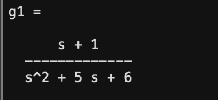
<br>
<br>
<br>
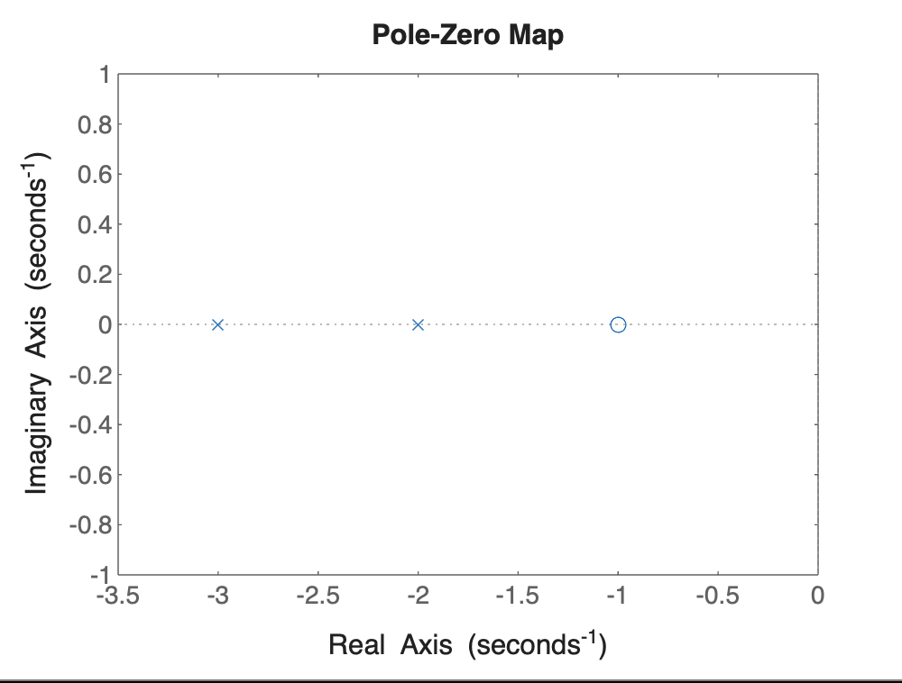

## G2 Code & Result:-

```bash
g2=tf(n2,d2)
 pzmap(g2)
```
## Command Line Output:-
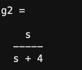
<br>
<br>
<br>
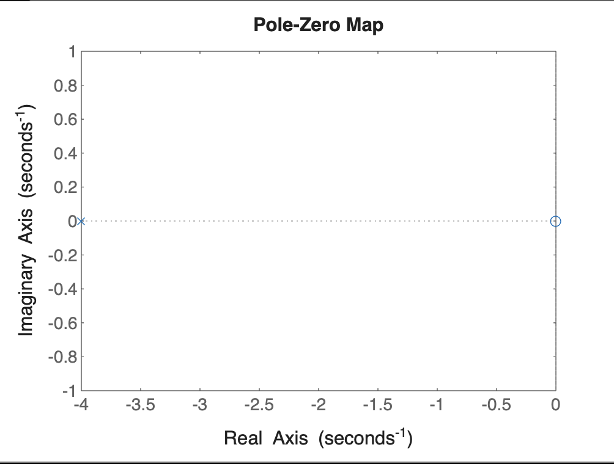


## G3 Code & Result:-

```bash
g3=parallel(g1,g2)
 pzmap(g3)
```
## Command Line Output:-
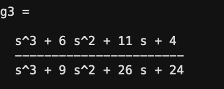
<br>
<br>
<br>
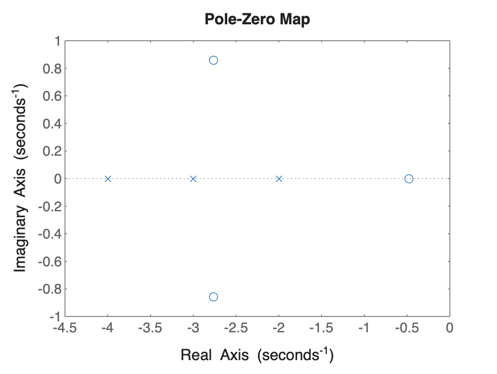


## G4 Code & Result:-

```bash
g4=series(g1,g2)
 pzmap(g4)
```
## Command Line Output:-
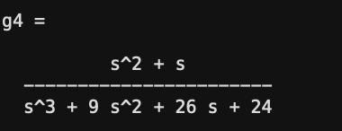
<br>
<br>
<br>
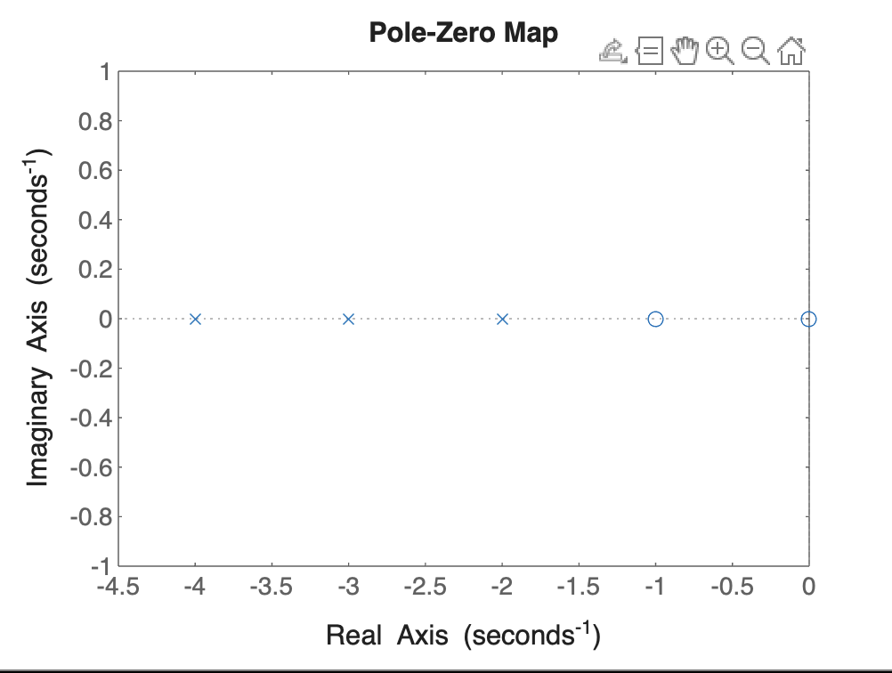


## G5 Code & Result:-

```bash
g5=feedback(g1,g2)
 pzmap(g5)
```
## Command Line Output:-
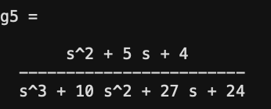
<br>
<br>
<br>
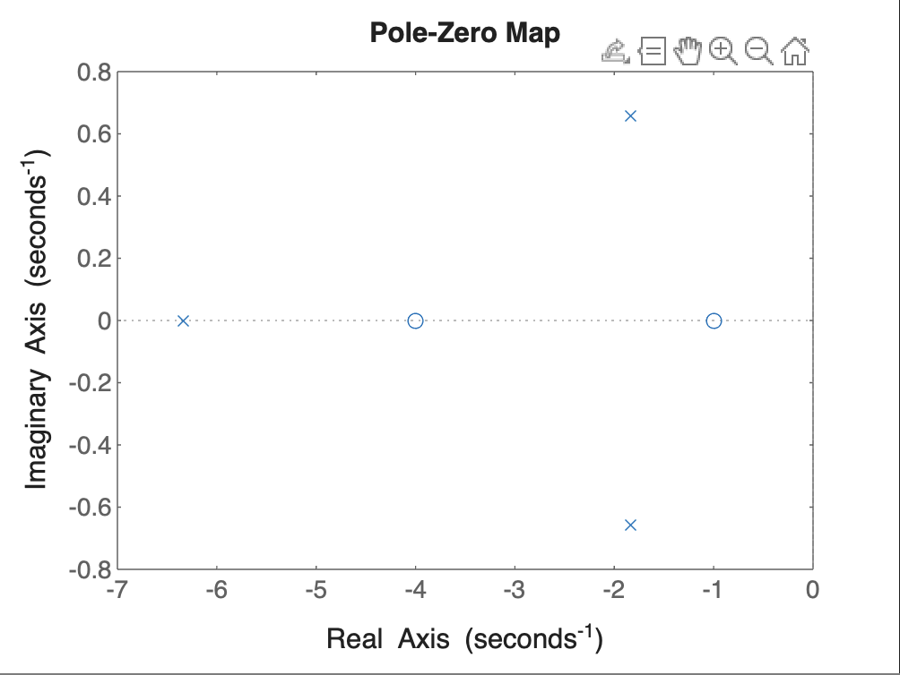


## G6 Code & Result:-

```bash
g6=feedback(g1,g2,1)
pzmap(g6)
```
## Command Line Output:-
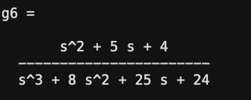
<br>
<br>
<br>
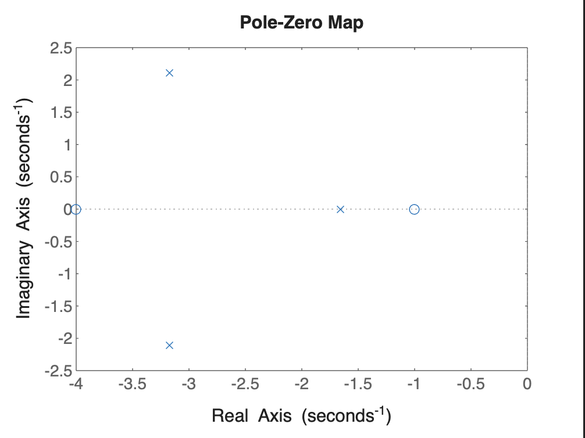


## G7 Code & Result:-

```bash
g7=feedback(g1,1)
pzmap(g7)
```
## Command Line Output:-
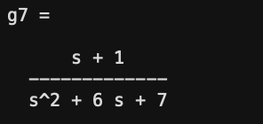
<br>
<br>
<br>
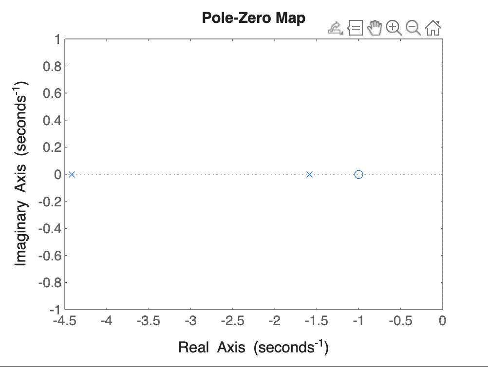