# EXP-2

## Objective:-

### To determine the time response curve of type zero, type one and type two control systems with step and impulse input

## Step Response of Type Zero System:-

### Code:-
```bash
n1= [1];
d1= [5 1];
g1=tf (n1, d1) 
 t=0:0.1:10;
 y1=step (g1,t);
plot(t,y1);
xlabel('time');
ylabel('y1');
title('step response of type zero system');
```

### Graph & Command Line Output:-

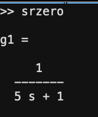
<br>
<br>
<br>
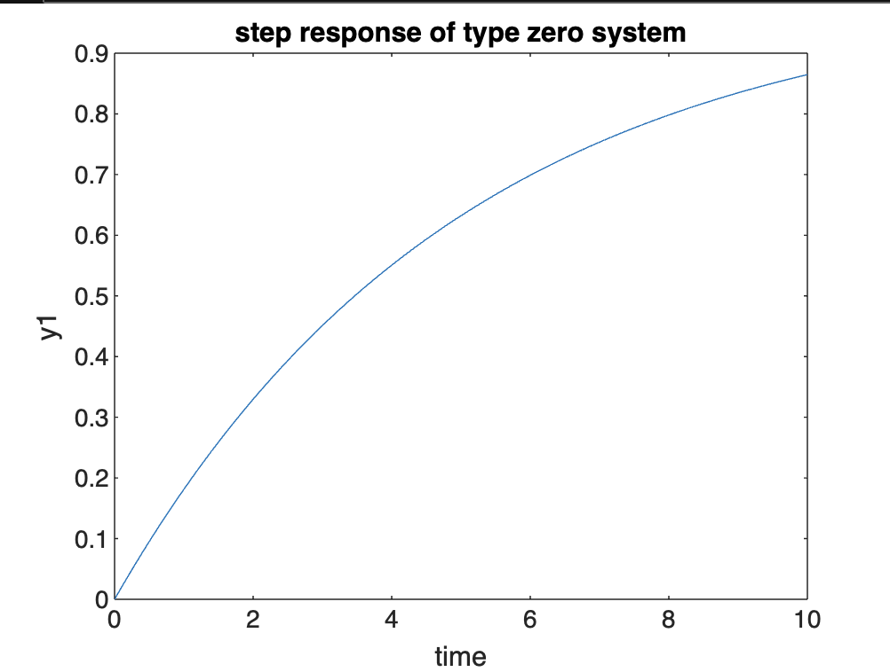

## Impulse Response of Type Zero System:-

### Code:-
```bash
 n1=[1];
 d1=[5 1];
 g1=tf(n1,d1)
 t=0:0.1:10;
 y2=impulse(g1,t);
plot(t,y2);
xlabel('time');
ylabel('y2');
title('impluse response of type zero system');
```

### Graph & Command Line Output:-

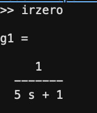
<br>
<br>
<br>
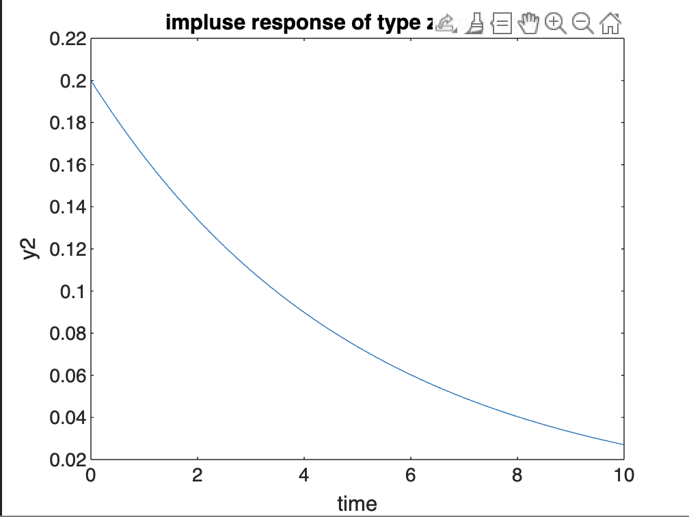


## Step Response of Type One System:-

### Code:-
```bash
  n2=[1];
 d2=[5 1 0];
 g2=tf(n2,d2)
  t=0:0.1:10;
 y3=step(g2,t);
plot(t,y3);
xlabel('time');
ylabel('y3');
title('step response of type one system');
```

### Graph & Command Line Output:-

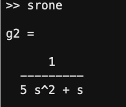
<br>
<br>
<br>
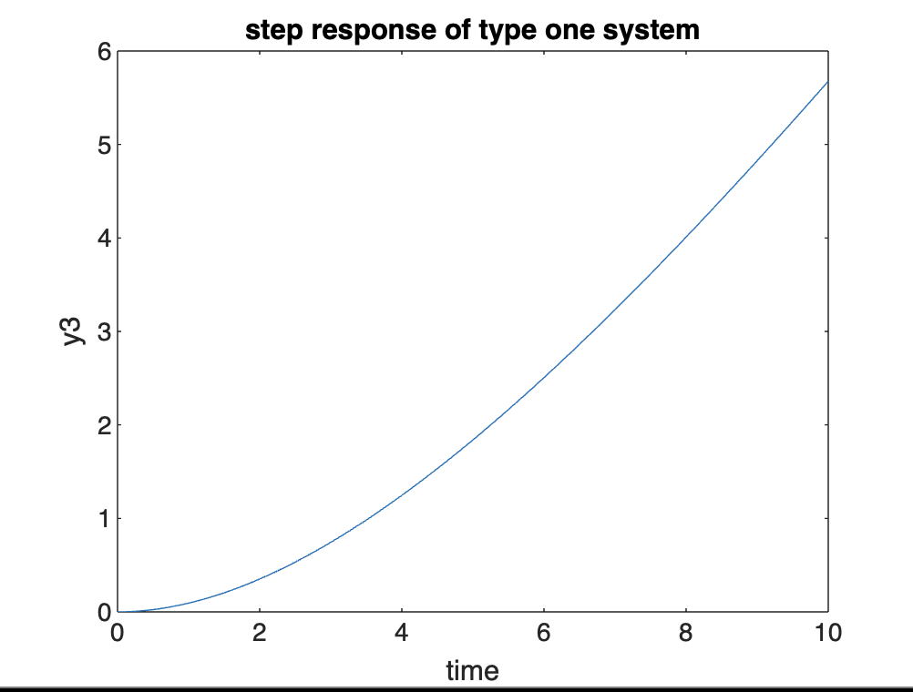

## Impulse Response of Type One System:-

### Code:-
```bash
  n2=[1];
 d2=[5 1 0];
 g2=tf(n2,d2)
  t=0:0.1:10;
 y4=impulse(g2,t);
plot(t,y4);
xlabel('time');
ylabel('y4');
title ('impulse response of type one system');
```

### Graph & Command Line Output:-

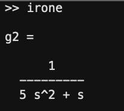
<br>
<br>
<br>
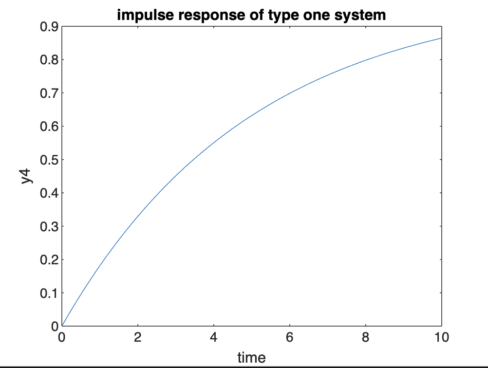

## Step Response of Type Two System:-

### Code:-
```bash
  n3=[1];
 d3=[5 1 0 0];
 g3=tf(n3,d3)
  t=0:0.1:10;
 y5=step(g3,t);
plot(t,y5);
xlabel('time');
ylabel('y5');
title('step response of type two system');
```

### Graph & Command Line Output:-

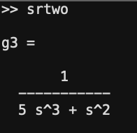
<br>
<br>
<br>
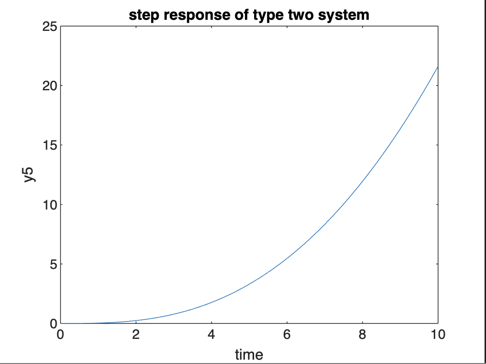


## Impulse Response of Type Two System:-

### Code:-
```bash
 n3=[1];
d3=[5 1 0 0];
 g3=tf(n3,d3)
  t=0:0.1:10;
 y6=impulse(g3,t);
plot(t,y6);
xlabel('time');
ylabel('y6');
title ('impulse response of type two system');
```

### Graph & Command Line Output:-

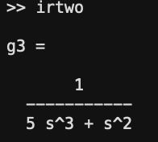
<br>
<br>
<br>
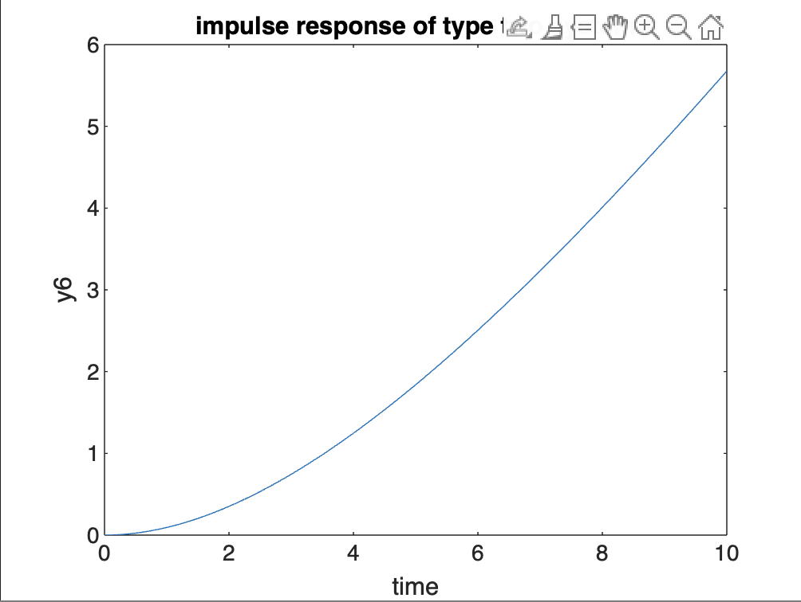