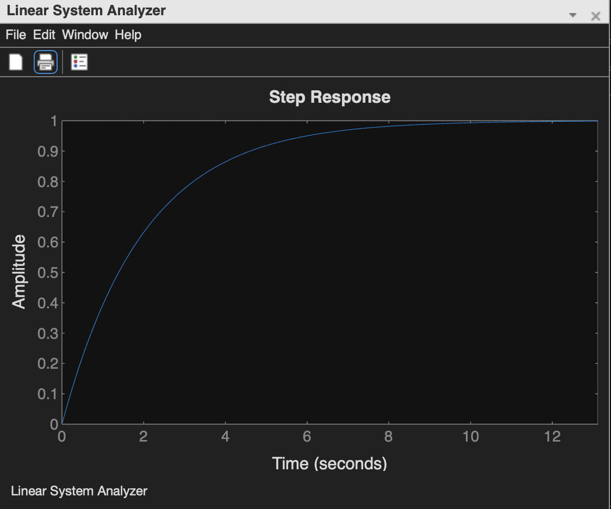
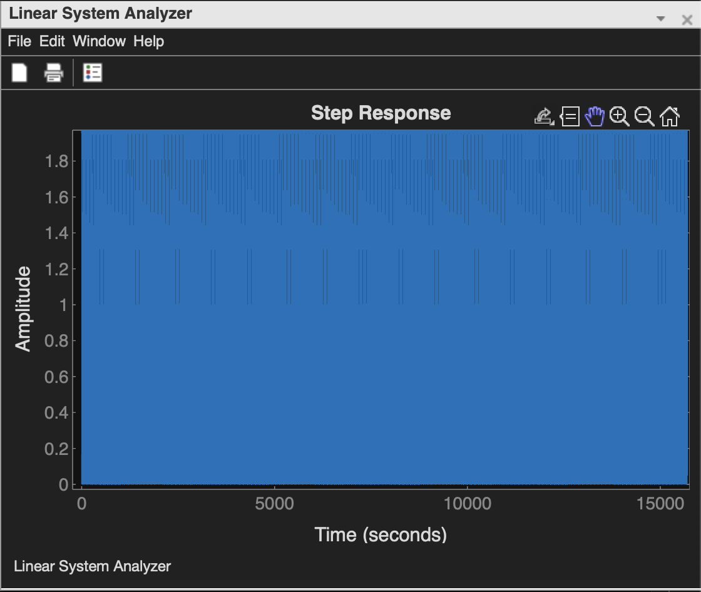
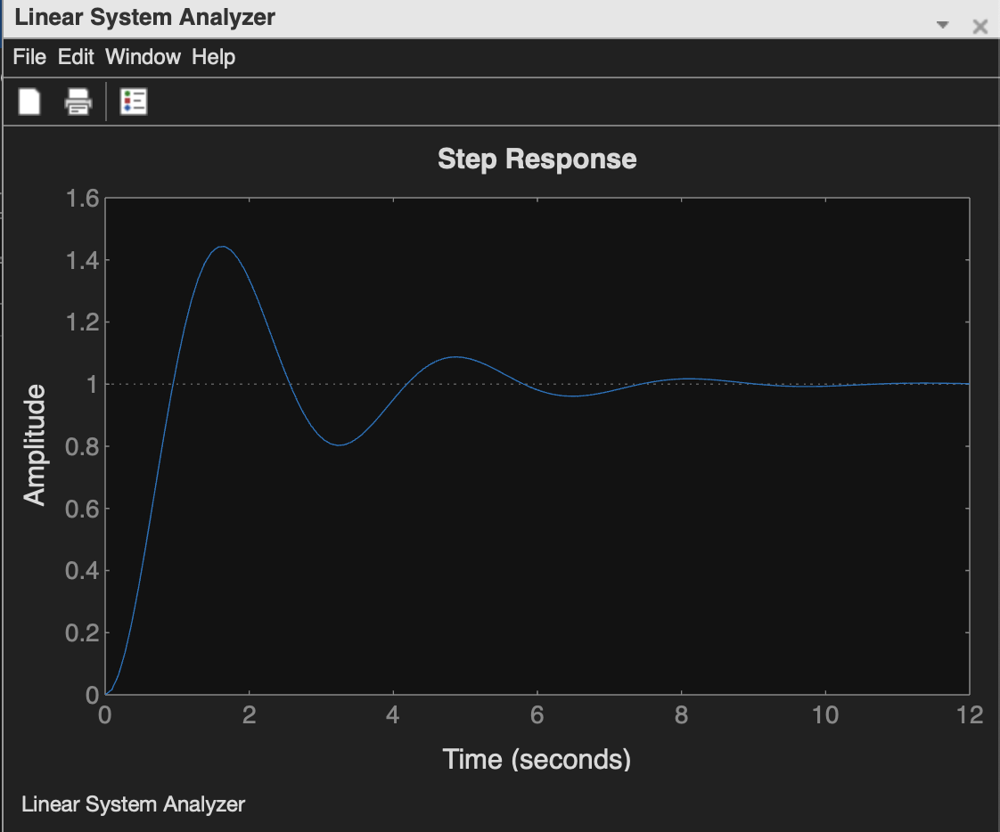
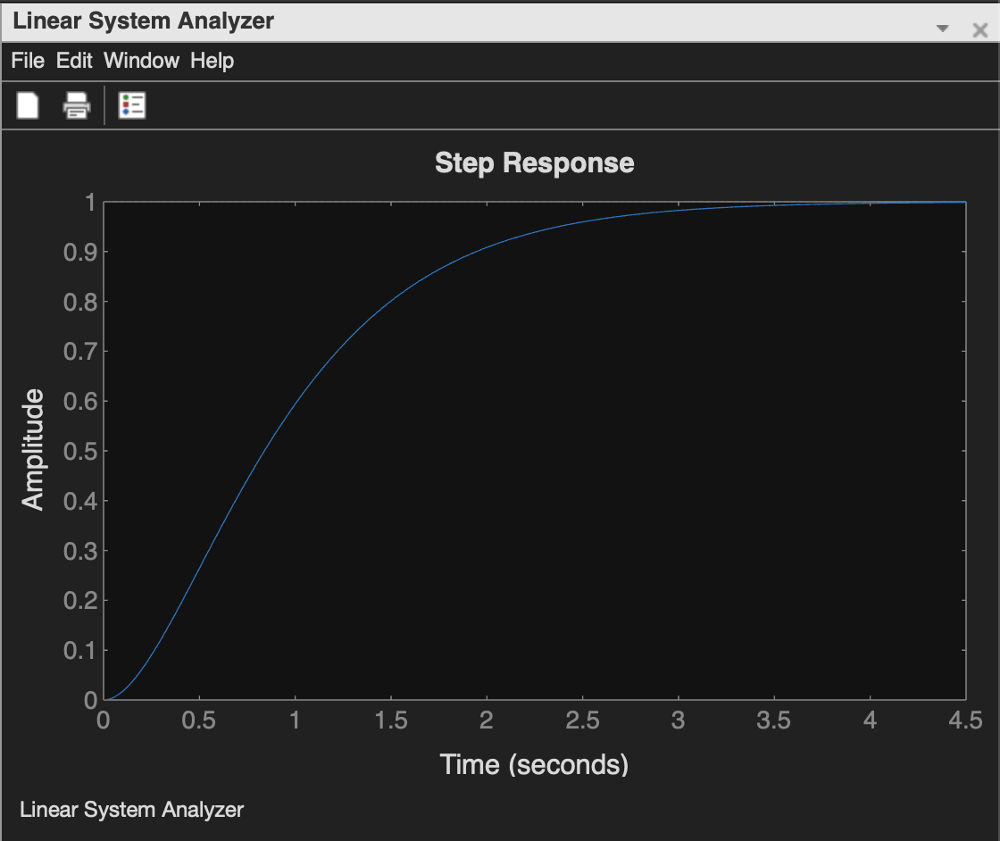
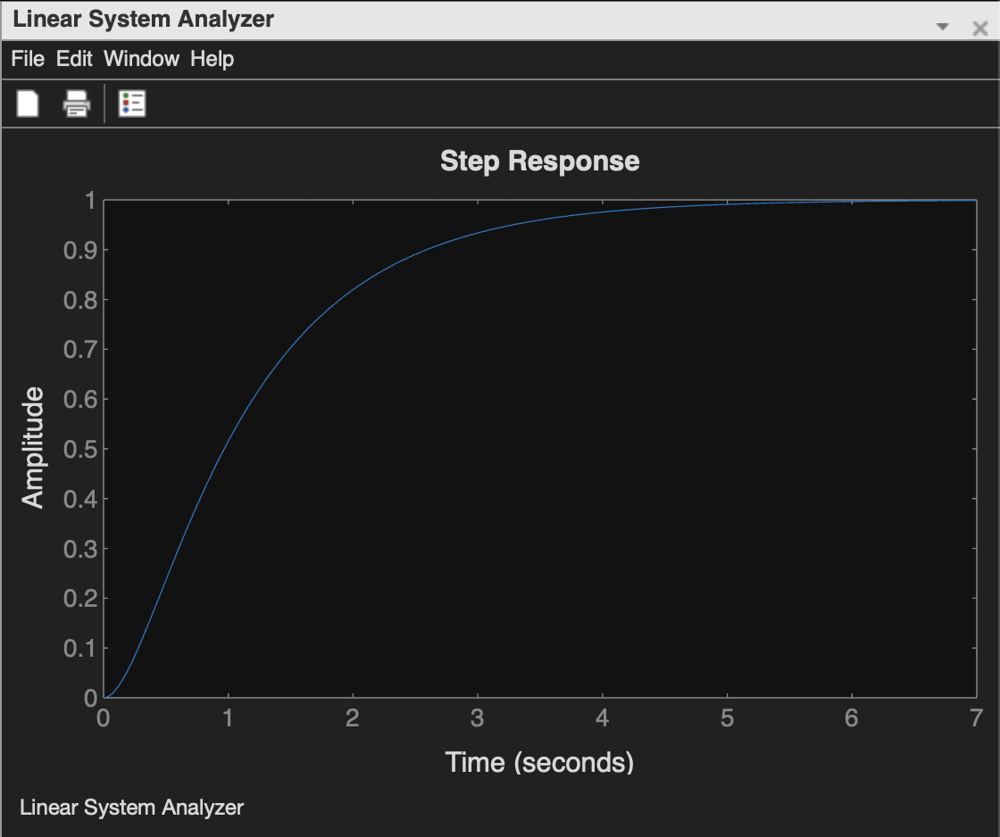

# EXP-3

## Objective:-

### To determine the step response for a 1st order system and for a 2nd order system.


## 1st Order

```bash
 n1= [1];
	d1= [2 1];
 g1= tf (n1, d1);
 t=0:0.1:10;
 y1= step (g1, t);
ltiview ("step", g1)

```



## 2nd Order undamped system (ζ=0):

```bash
wn=2;
zeta=0;
n1= [wn^2];
 d1= [1 2*zeta*wn wn^2];
g1=tf (n1, d1);
t=0:0.1:10;
y1=step (g1, t);
ltiview ("step", g1)

```



## 2nd underdamped system (ζ<1):

```bash
wn=2;
zeta=0.25;
n1= [wn^2];
d1= [1 2*zeta*wn wn^2];
 g1=tf (n1, d1);
 t=0:0.1:10;
 y1=step (g1, t);
ltiview ("step", g1)   
```



## 2nd Order critical dammed (ζ=1):

```bash
wn=2;
zeta=1;
 n1= [wn^2];
 d1= [1 2*zeta*wn wn^2];
 g1=tf (n1, d1);
 t=0:0.1:10;
 y1=step (g1, t);
ltiview ("step", g1)    

```


## 2nd Order overdamped system (ζ>1):

```bash
wn=2;
zeta=1.25;
 n1= [wn^2];
 d1= [1 2*zeta*wn wn^2];
 g1=tf (n1, d1);
 t=0:0.1:10;
 y1=step (g1, t);
ltiview ("step", g1)

```
