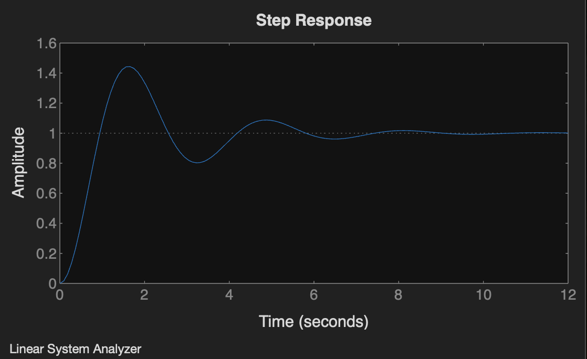
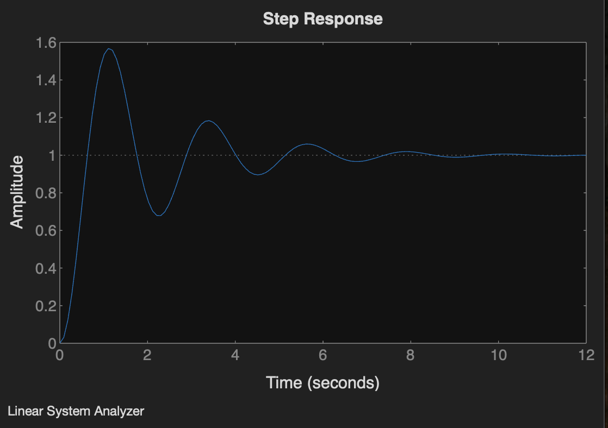
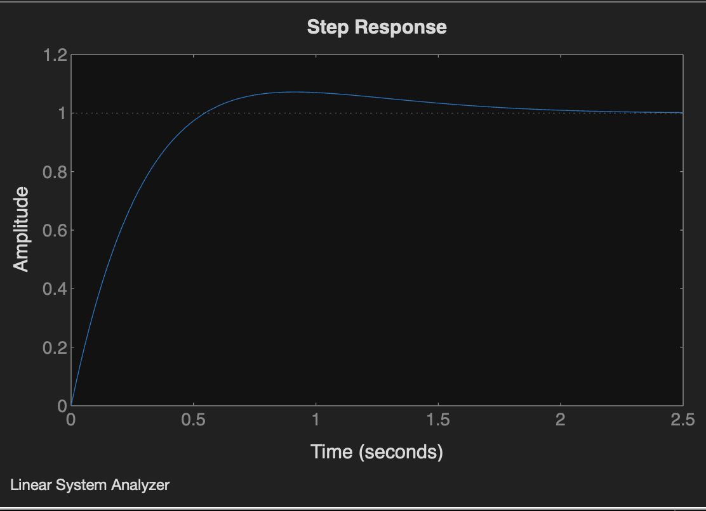
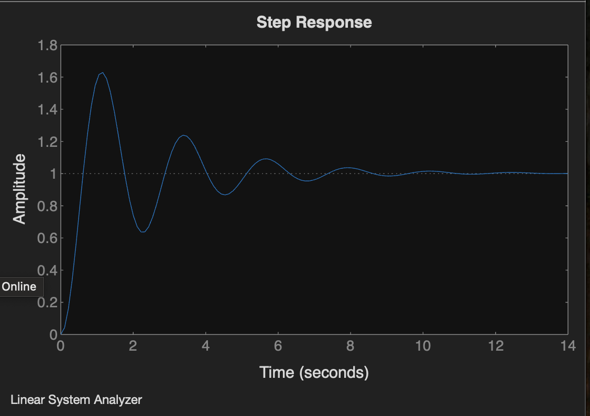
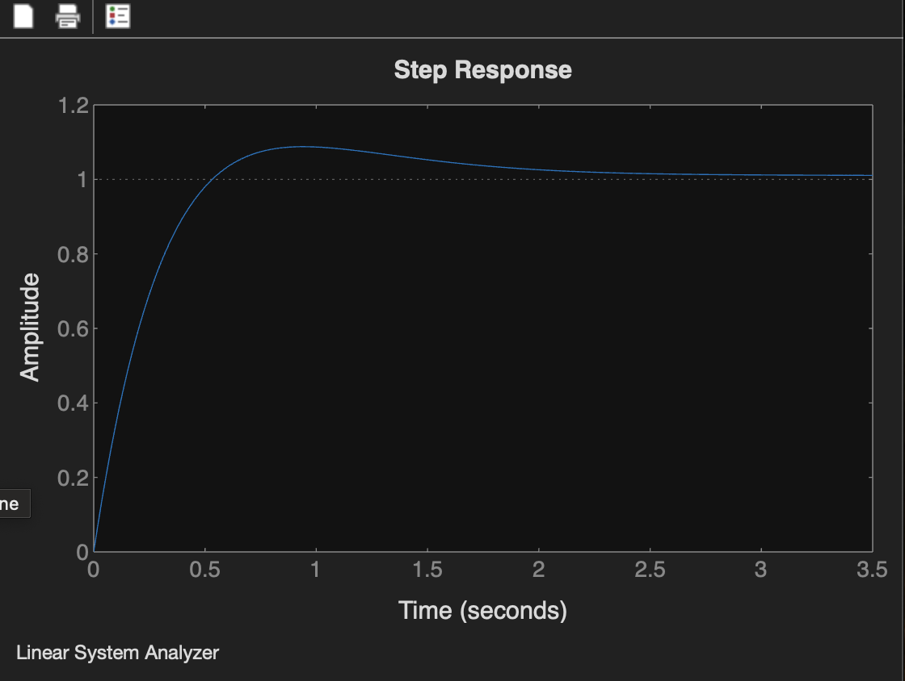

# EXP-5

## Objective:-

###  P,PI,PD,PID Controller Design


## Unity Function

```bash
  wn=2;
 zeta=0.25;
 n1=[wn^2];
 d1=[1 2*zeta*wn wn^2];
 g1=tf(n1,d1);
 t=0:0.1:10;
y1=step(g1,t);
ltiview('step', g1)


```



## P Controller:

```bash
 n2=[8];
 d2=[1 1 8];
 g2=tf(n2,d2);
 t=0:0.1:10;
 y2=step(g2,t);
 ltiview('step', g2)


```



## PD Controller:
```bash
 n3=[4 8];
 d3=[1 5 8];
 g3=tf(n3,d3);
 t=0:0.1:10;
 y3=step(g3,t);
 ltiview('step', g3)

```



## PI Controller:

```bash
 n4=[8 1];
 d4=[1 1 8 1];
 g4=tf(n4,d4);
 t=0:0.1:10;
 y4=step(g4,t);
 ltiview('step', g4)
   

```


## PID Controller:

```bash
 n5=[4 8 1];
 d5=[1 5 8 1];
 g5=tf(n5,d5);
 t=0:0.1:10;
y5=step(g5,t);
 ltiview('step', g5)


```
