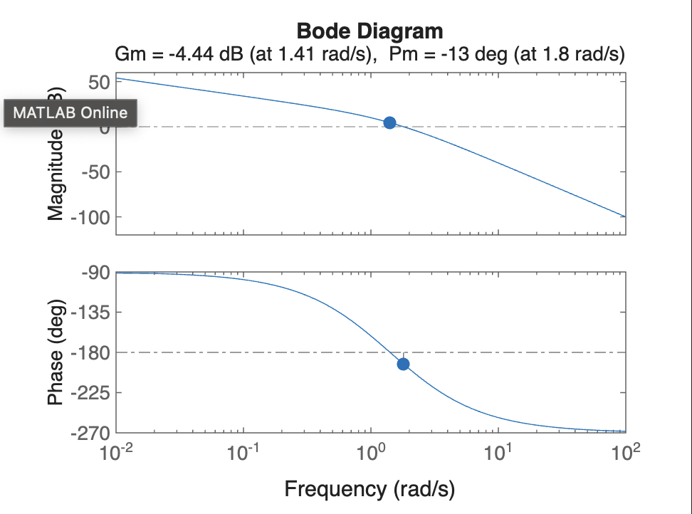
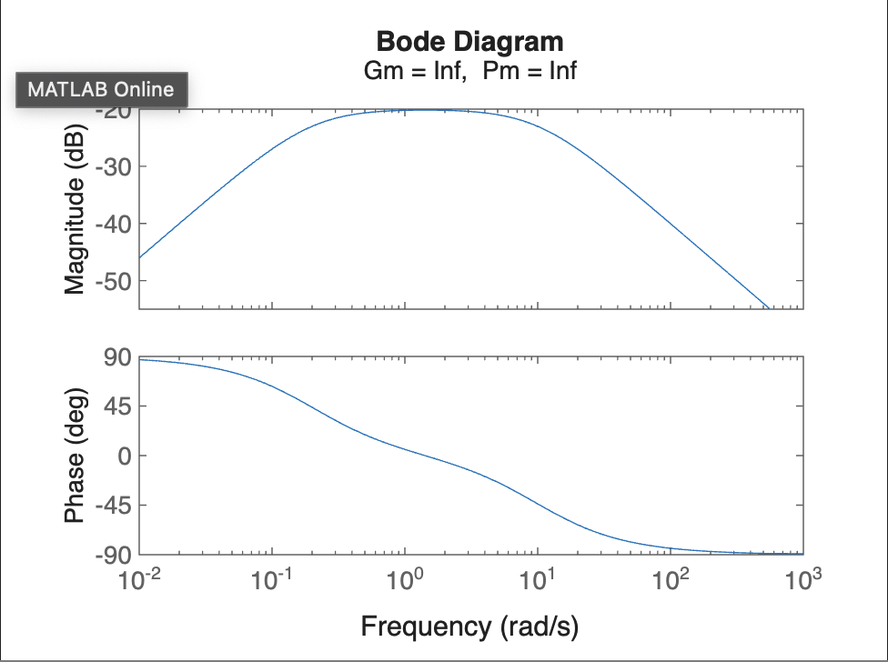

# EXP-7

## Objective:-

###  Determination of Root Locus of the Transfer Functions using Bode Plot.


## Prob -1 :-


```bash
% Transfer Function: G(s)H(s) = 10 / (s^3 + 3s^2 + 2s)
n1 = [10];
d1 = [1 3 2 0];
g1 = tf(n1, d1);

% Bode Plot
bode(g1);
margin(g1);  % Shows Gain Margin & Phase Margin
```


## Output



<br>
<br>
<br>
<br>


## Prob -2:-

```bash
% Transfer Function: G(s)H(s) = s / (s^2 + 10.2s + 2)
n2 = [1 0];
d2 = [1 10.2 2];
g2 = tf(n2, d2);

% Bode Plot
bode(g2);
margin(g2);
```


## Output:-



