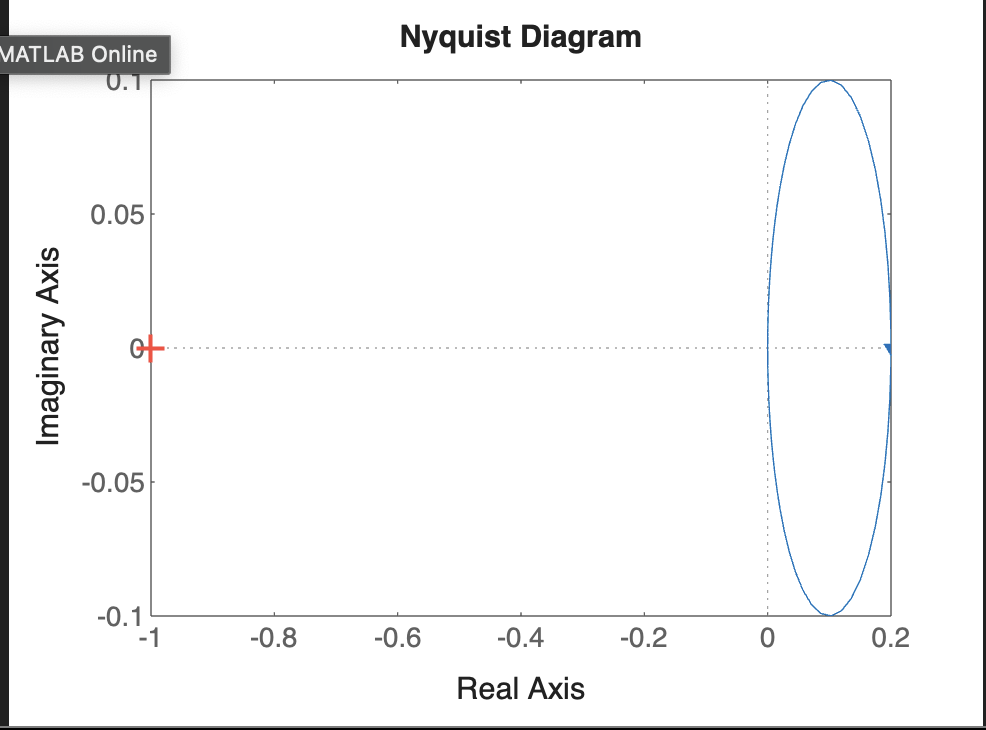
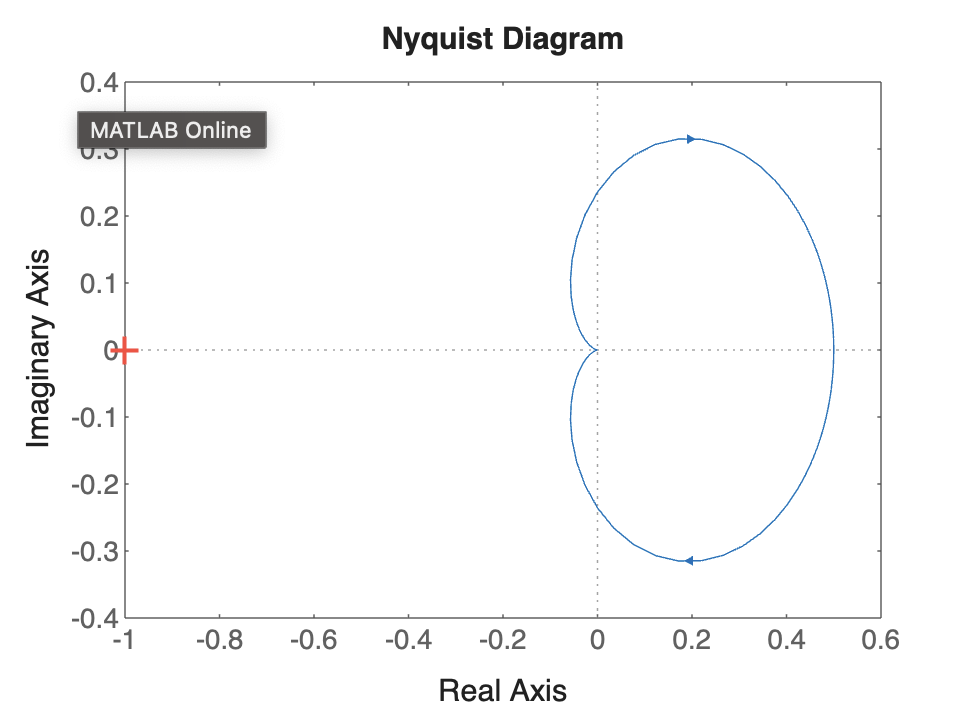

# EXP-8

## Objective:-

###  Determining the stability of a closed loop system using Nyquist stability criterion.


## Prob -1 :-


```bash
% Transfer Functions: G(s) = 1 / (s + 5), H(s) = 1 / s
g = tf([1], [1 5]);
h = tf([1], [1 0]);

% Closed-loop system with feedback
g1 = feedback(g, h);

% Nyquist Plot
nyquist(g1);

% Gain Margin & Phase Margin
[gm, pm, wcg, wcp] = margin(g1);
```


## Output



<br>
<br>
<br>
<br>


## Prob -2:-

```bash
% Transfer Functions: G(s) = s / (2s + 3), H(s) = 1 / s^2
g = tf([1 0], [2 3]);
h = tf([1], [1 0 0]);

% Closed-loop system with feedback
g1 = feedback(g, h);

% Nyquist Plot
nyquist(g1);

% Gain Margin & Phase Margin
[gm, pm, wcg, wcp] = margin(g1);
```


## Output:-



